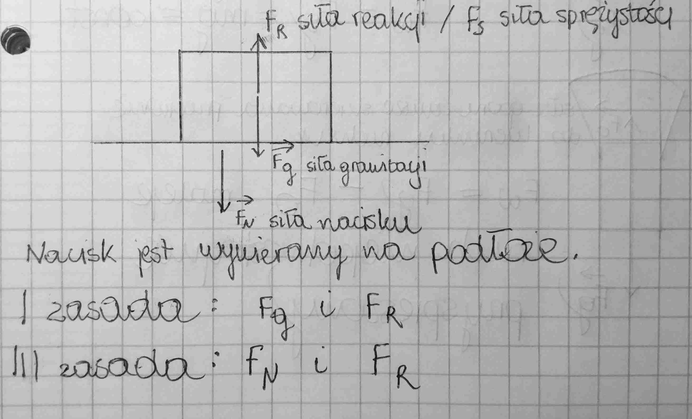
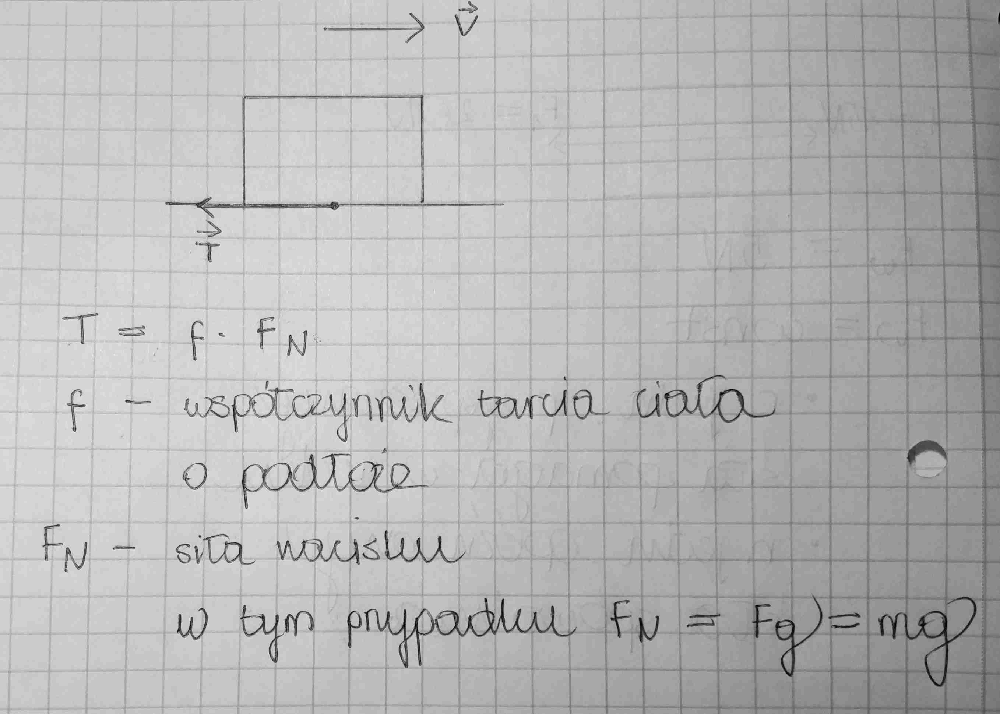

# Tarcie i inne siły działające na ciało.

## Siły powszechne

W najprostszym przypadku, na ciało działa siła grawitacji (ciężkości) i siła reakcji.

Ciało jest przyciągane do środka Ziemi przez siłę grawitacji. Wywołuje ono nacisk na podłoże, działając na nie siłą nacisku. Podłoże odreagowuje na ciało siłą reakcji, o tej samej wartości i przeciwnym zwrocie.

## Tarcie ciała o podłoże

T[N] Siła pojawiająca się na styku trących powierzchni, przeciwnie do kierunku ruchu powierzchni trącej.

Wartość siły tarcia zależy od

1. materiału trącej powierzchni
2. siły nacisku ciała na podłoże

Ciało w ruchu doświadcza działania oporu, który nazywamy siłą tarcia. Tarcie utrudnia wzajemny ruch między stykającymi się ciałami, ale z drugiej strony pozwala nam się poruszać, co staje się oczywiste, jeśli zobaczymy, jak trudno jest nam chodzić po powierzchniach śliskich (np. po lodzie).

### Tarcie statyczne i kinetyczne

Jeśli dwa spoczywające ciała pozostają w kontakcie, to działa między nimi siła nazywana tarciem statycznym (ang. static friction). Jeśli dwa ciała pozostające w kontakcie przesuwają się względem siebie, to siła występująca między nimi nazywana jest tarciem kinetycznym (ang. kinetic friction).

| Statyczne                                     |                    Kinetyczne                    |
| --------------------------------------------- | :----------------------------------------------: |
| Powierzchnie trące spoczywają względem siebie | Powierzchnie trące poruszają się względem siebie |

$T_s$ > $T_{dyn}$

Tarcie statyczne zmienia się w tarcie dynamiczne w momencie gdy ciało zaczyna się poruszać. Zwróć uwagę na to, przesuwając szafę. Po wprawieniu jej w ruch, dalsze jej poruszanie jest łatwiejsze.

Teraz wyobraź sobie, że próbujesz przesunąć ciężką skrzynię po betonowej podłodze. Musisz pchać bardzo mocno, a i tak masz kłopot z ruszeniem skrzyni. Oznacza to, że próbie ruchu, który chcesz wykonać, przeciwstawia się tarcie statyczne. Jest ono równe co do wartości, ale przeciwnie skierowane do siły, którą przykładasz do skrzyni. Gdy w końcu uda ci się pchnąć skrzynię wystarczająco mocno, wykona ona nagły ruch, po czym jest w stanie dalej się przesuwać pod wpływem siły, którą działasz. Wówczas zaczyna działać tarcie kinetyczne. Co ważne, łatwiej jest utrzymywać skrzynię w ruchu niż w ogóle ją ruszyć. Oznacza to, że siła tarcia kinetycznego jest mniejsza niż siła tarcia statycznego.

Wykres siły tarcia od czasu. W momencie gdy ciało zostanie wprawione w ruch, tarcie gwałtownie spada.

[Wikipedia, by Loodog](https://en.wikipedia.org/w/index.php?curid=44320554) - Collected in a physics lab using a Vernier Dual-Range Force sensor, CC BY-SA 3.0,

### Mechanizm powstawania siły tarcia

Siła tarcia $\vec T$ zawsze przeciwstawia się ruchowi ciał lub próbie tego ruchu. Tarcie powstaje częściowo z powodu chropowatości powierzchni stykających się, jak to zostało przedstawione na powiększonym fragmencie rysunku. Aby obiekt się poruszył, musi delikatnie wznieść się, by wystające fragmenty powierzchni górnej mogły przesunąć się wzdłuż dolnej powierzchni. W związku z tym konieczne jest przyłożenie siły, aby wprawić ciało w ruch, a następnie ten ruch podtrzymać. Niektóre z wystających fragmentów powierzchni na skutek tarcia zostaną zniszczone.

### Siła tarcia w powiększeniu

Siła tarcia wynika z nierówności które ma każde ciało.

<iframe src="https://phet.colorado.edu/sims/html/friction/latest/friction_pl.html" width="100%" height="400" scrolling="no" allowfullscreen></iframe>

## Siły działające na spadochroniarza

Jakim ruchem porusza się spadochroniarz:

1. dopóki nie rozłoży spadochronu (opór pow. mały)
2. tuż po rozłożeniu spadochronu
3. po dłuższym czasie od rozłożenia spadochronu

::: warning Pomyśl
Odpowiedź poniżej.
:::

:arrow_double_down:

:arrow_down_small:

:warning:

1. dopóki nie rozłoży spadochronu (opór pow. mały).

   ruch jednostajnie przyspieszony
   $F_w = F_g = mg = const$

2. tuż po rozłożeniu spadochronu

   ruch niejednostajnie przyspieszony
   $F_w = F_g - F_o$

   $F_w$ maleje

   Siła oporu zawsze skierowana jest przeciwnie do kierunku ruchu.

3. po dłuższym czasie od rozłożenia spadochronu

   ruch jednostajnie przyspieszony

   $F_w = 0N$

   $F_o = F_g$

Na podstawie: Katalyst Education, [Fizyka dla szkół wyższych.](http://cnx.org/contents/4eaa8f03-88a8-485a-a777-dd3602f6c13e@1.144) Tom 1. OpenStax CNX. Aug 9, 2019
