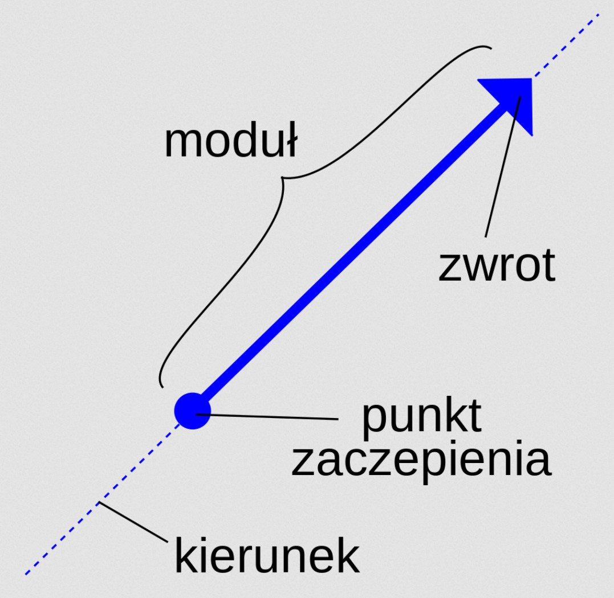
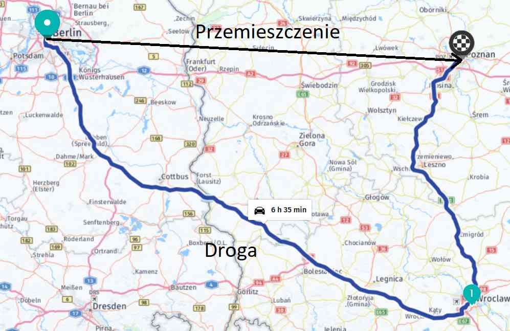
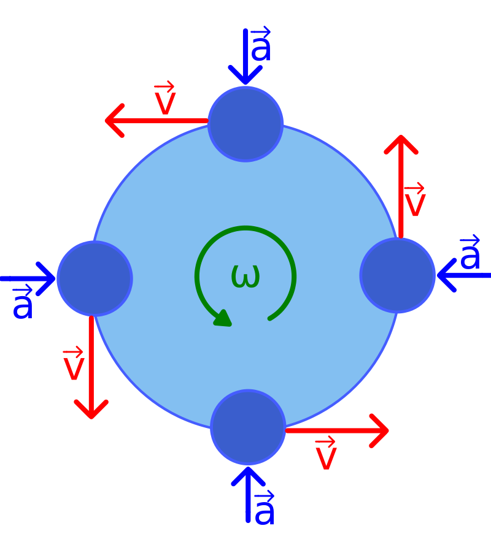

# Opis ruchu prostoliniowego

Podstawowe jednostki miary w kinematyce to

- droga i przemieszczenie
- szybkość i prędkość
- przyspieszenie.

## Wektor

Wektor posiada natępujące cechy:

`kierunek, zwrot, wartość (moduł), punkt przyłożenia`

## Droga i przemieszczenie

- Droga $s[m]$ to długość toru po którym porusza się ciało. Np. 600km
- Przemieszczenie $\triangle r[m]$ to wektor najkrótszej odległości między punktem początkowym a końcowym toru.

## Prędkość

Wielkość fizyczna opisująca szybkość zmiany położenia ciała względem układu odniesienia.

Prędkość może określać:

- wektorową wielkość fizyczną wyrażająca zmianę wektora położenia w jednostce czasu $\vec{v}=\frac{\triangle \vec{r}}{t}$
- skalarną wielkość oznaczającą przebytą drogę w jednostce czasu zwaną szybkością $\vec{v}=\frac{{s}}{t}$.

### Sprawdź czy rozumiesz!

Czy w ruchu jednostajnym po okręgu prędkość (wektorowa) jest stała?
::: warning Pomyśl
Odpowiedź poniżej.
:::

:arrow_double_down:

:arrow_down_small:

:warning:

Pamiętajmy, że pytają nas o prędkość jako wielkość wektorową. Rozważmy więc czy wszystkie jej cechy są stałe:

- kierunek: zmienia się
- zwrot: zmienia się
- wartość: stała
- punkt przyłożenia: stały

Odp: Nie, ponieważ zmienia się kierunek i zwrot.

Zauważ, że kierunek prędkości w ruchu po okręgu jest zawsze styczny do okręgu po którym porusza się obiekt.

## Przyspieszenie

Jest to wielkość wektorowa którą obliczamy dzieląc przyrost prędkości przez czas. Im większe jest przyspieszenie, tym większa jest zmiana prędkości w danym przedziale czasu.

$\vec{a}=\frac{\vec{\triangle v}}{t}$

Jednostkę przyspieszenia określamy, dzieląc jednostkę prędkości przez jednostkę czasu. Ponieważ przyspieszenie jest prędkością wyrażoną w jednostkach metr na sekundę, podzieloną przez czas, w sekundach, to jednostką przyspieszenia w układzie SI jest $\frac{m}{s^2}$. Dosłownie możemy rozumieć przyspieszenie jako miarę tego, o ile metrów na sekundę prędkość zmienia się w ciągu każdej sekundy.

[$a$] = $\frac{\frac{m}{s}}{s} = \frac{m}{s^2}$

### Zwrot wektora przyspieszenia

Pamiętaj, że chociaż przyspieszenie ma kierunek zmiany prędkości, to nie zawsze jest zwrócone w kierunku ruchu. Gdy ciało hamuje w ruchu prostoliniowym, wektor przyspieszenia jest przeciwny do kierunku, w którym ciało się porusza. Takie przyspieszenie (o zwrocie przeciwnym do wektora prędkości, przeciwnie do ruchu) nazywamy często opóźnieniem – patrz rysunek. Rozumiemy je jednak jako przyspieszenie o zwrocie przeciwnym do kierunku ruchu.

